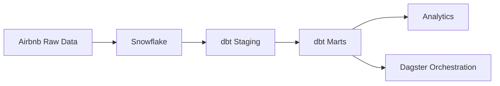
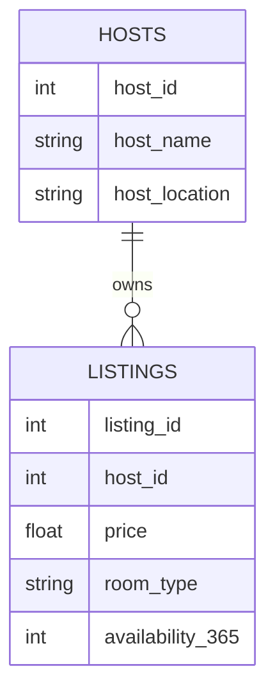

# Airbnb Analytics Engineering Project

**Snowflake • dbt • Dagster**

An end-to-end analytics engineering project implementing a modern data stack using Snowflake for warehousing, dbt for transformations, and Dagster for orchestration on the Airbnb dataset.

This repository demonstrates production-style data modeling, testing, and orchestrated pipelines.

---

# Architecture



---

# Data Model




---

# dbt Models

**Staging**

* `stg_hosts` — cleaned host data
* `stg_listings` — standardized listings

**Marts**

* `dim_hosts` — host dimension
* `fct_listings` — listings fact table

**Grain**

* hosts → 1 row per host
* listings → 1 row per listing

---

# Orchestration

Dagster orchestrates dbt assets:

* model runs
* tests
* snapshots
* lineage

Run locally:

```bash
cd my_dbt_dagster_project
dagster dev
```

---

# Running the Project

```bash
pip install dbt-snowflake dagster dagster-dbt
dbt deps
dbt run
dbt test
```

---

# Project Structure

```
airbnb/
├── models/                 # dbt models
├── snapshots/              # SCD tracking
├── seeds/                  # source data
├── tests/                  # data tests
├── my_dbt_dagster_project/ # orchestration
├── dbt_project.yml
└── packages.yml
```

---

# Skills Demonstrated

* Snowflake data warehousing
* dbt modeling & testing
* dimensional modeling
* Dagster orchestration
* modern data stack

---

# Author

**William Johnson**
Data / Analytics Engineer
